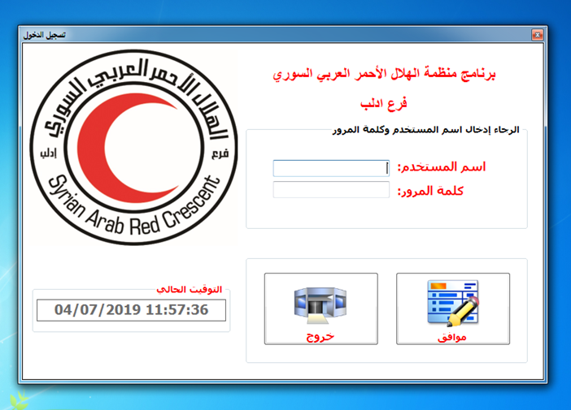
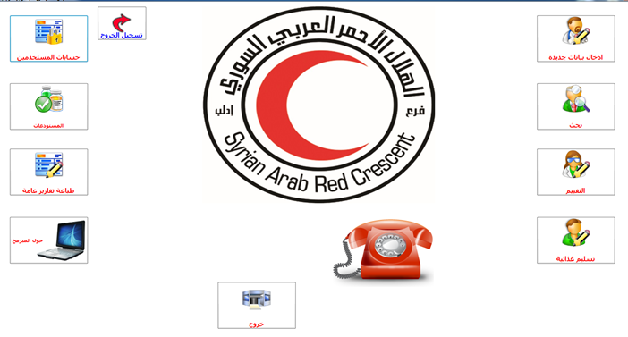

<table border=0>
<tr border=0>
<td>  </td>
  <td align="center"> <h5> At <a href="https://www.icrc.org/en">the  International Committee of the Red Cross </a> & <a href="https://sarc.sy/home/">the Syrian Arab Red Crescent
</a></h5> </td>
  <td>  </td>
</tr>
<tr border=0>
<td> </td><td  align="center"> <h5> Project Topic </h5> </td><td> </td>
</tr>
<tr border=0>
<td> </td><td> </td><td> </td>
</tr>
  <tr>
    <td> </td>
<td align="center"><h5>"Management System Application"</h5></td>
    <td> </td>
</tr>
  <tr>
    <td> </td>  <td align="center"></td>
    <td> </td>
</tr>
</table>

# Red Cross and red Crescent Management System Application using C# and SQL server

<h5> At <a href="https://www.linkedin.com/company/syredcrescent/">the  International Committee of the Red Cross </a> & <a href="https://www.linkedin.com/company/syredcrescent/">the Syrian Arab Red Crescent
</a></h5> 

## Will uploaded soon

# Application Development Stages 
- System Analysis 
- Database Analysis
- Database Modeling
- Database building 
- Application user interfaces building (which include family names - food distribution / food supply - supply of medicine, cosmetics etc. - stock management - User administration - general reports - ...- ))
- Support the system during three years.

## Contributors
- Mohamed Mesto, m.mesto@campus.tu-berlin.de , Mohamedmesto111@gmail.com

## Technologies :computer: 

### Frontend
- C#.net
- Photoshop
- 

### Backend
- C#.net

### Database
- SQL Server

# Applicants System 

## Stretch Goals :goal_net:

